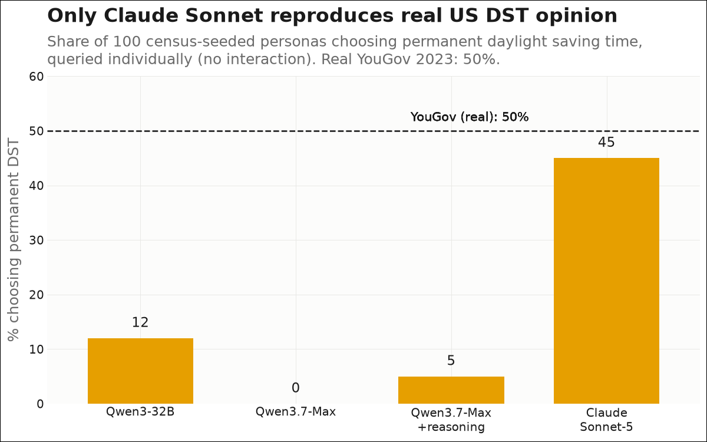
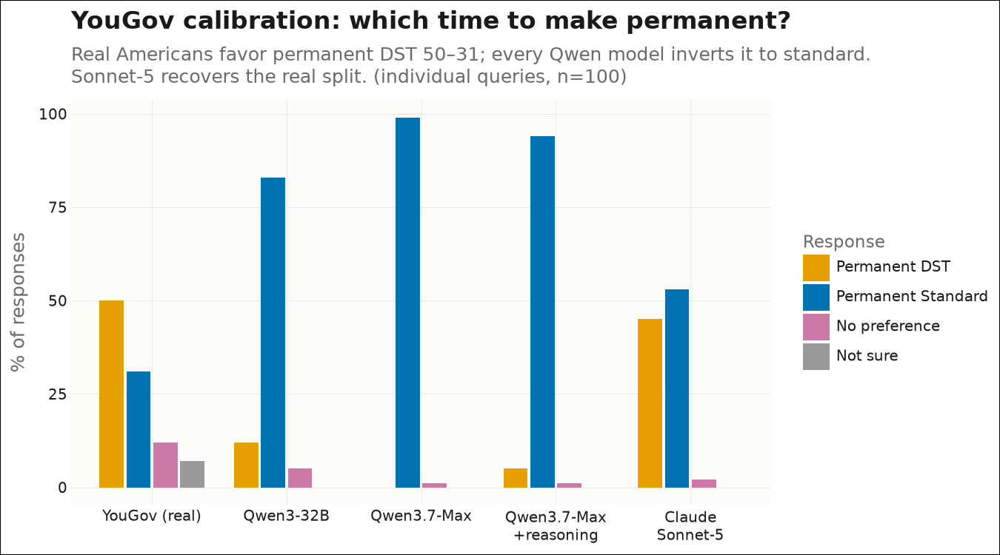
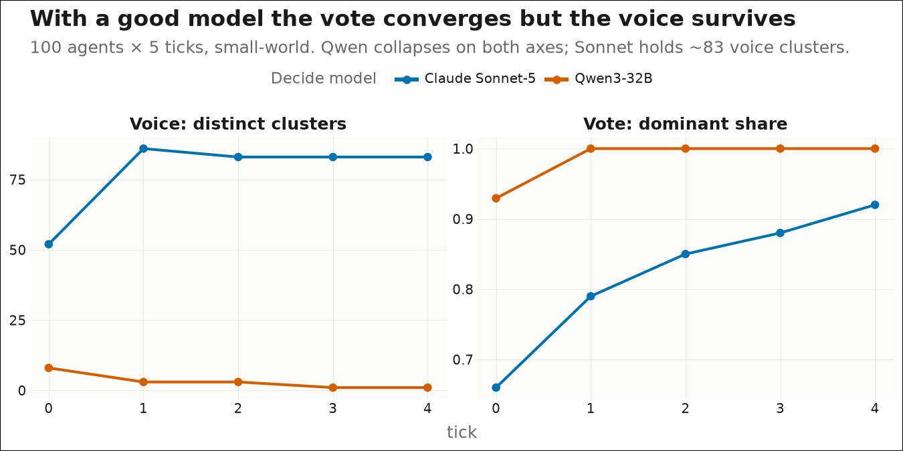
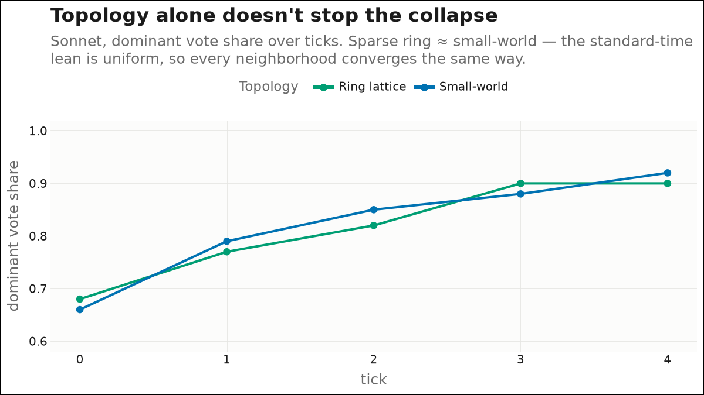
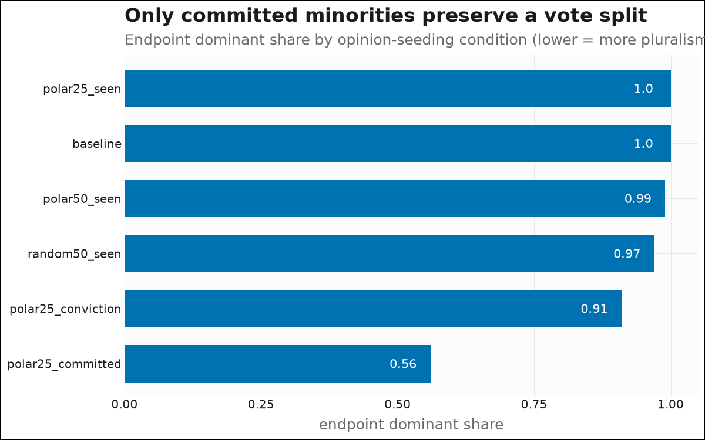
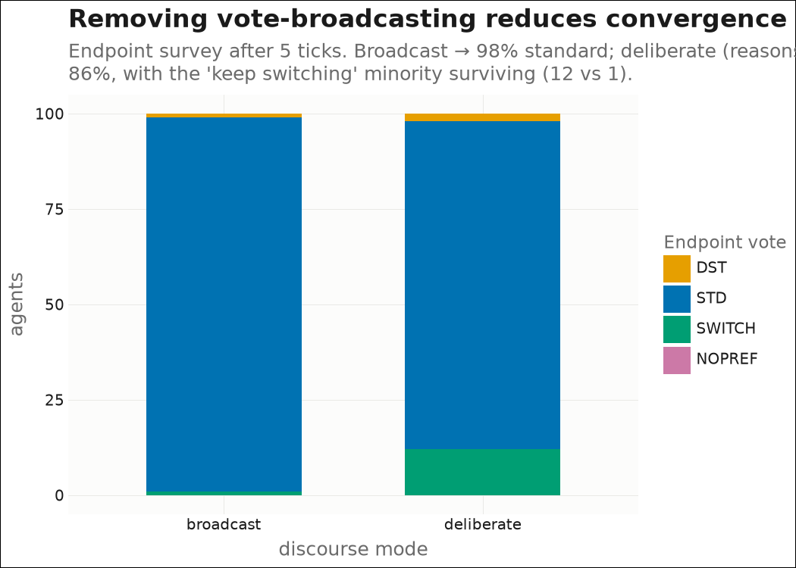

## The question

Can ~100 census-seeded LLM personas, **queried individually**, reproduce real US
public opinion on daylight saving time — and what happens to that opinion when the
personas talk to each other over a social network? Ground truth is the **YouGov
"Daylight Saving Time" survey** (1,000 U.S. adults, March 2023).

Figures are built by `sandbox/build_figures.py` from the saved experiment CSVs; colors
and labels come from `src/polis/viz_theme.py` (Okabe-Ito, colorblind-safe).

## Headline — only Claude Sonnet reproduces real opinion

We seed 100 personas from ACS PUMS demographics + donor-matched disposition data
(ANES/GSS/ATUS), then **query each persona individually** (no interaction) with the
real YouGov question. Sonnet-5's silicon sample lands at **45% permanent DST** against
the real **50%**. Every Qwen model collapses onto a standard-time "expert" prior and
gets it backwards — this was a **model artifact**, not a failure of the persona pipeline.

The full distribution shows the same story — real Americans (and Sonnet) split DST vs
standard; the Qwen models drive ~all mass to standard:

## Two axes — the vote converges, the voice survives

When the personas talk over a small-world graph for 5 ticks, the **vote** (stance)
converges under both models — but with Sonnet the **voice** (how each persona argues)
stays richly diverse (~83 distinct clusters among 100 agents), where Qwen collapses to
a single templated voice. So persona depth protects the *voice*; the *vote* still moves.

## The vote-convergence is genuine dynamics — not the model

The residual vote-convergence (Sonnet still ends ~92% standard) is a real interaction
effect, and we can dissect it:

**Topology alone doesn't stop it** — a sparse ring converges just like a small-world
graph, because the standard-time lean is *uniform* across the population, so every
neighborhood independently converges the same way.

**Only a committed minority preserves a split** — soft opinion seeding barely moves the
endpoint, but an immovable (R11) seeded faction holds a genuine 56/44 split.

**Removing vote-broadcasting helps, partially** — if agents exchange *reasons* instead
of *stances* each tick (deliberate mode), and the vote is read only at the end,
convergence drops from 98% → 86% and the minority survives. But reasons carry the
population's bias too, so it doesn't fully prevent the collapse.

## Takeaways

1. **A census-seeded silicon sample can reproduce real US DST opinion — with the right
   model.** Sonnet-5 calibrates near YouGov; Qwen inverts it. Model choice, not persona
   design, was the binding constraint.
2. **LLMs express the expert/normative consensus** (permanent standard time) and
   override even demographically-grounded personas wherever public opinion diverges
   from expert opinion — the DST-vs-standard question is exactly such a case.
3. **Convergence has two independent sources**: a model-collapse artifact (fixed by a
   better model) and genuine interaction dynamics (studied via topology, committed
   minorities, and a reason-vs-vote action space).
